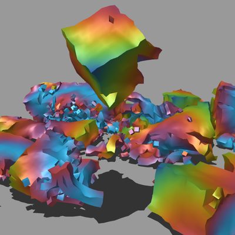
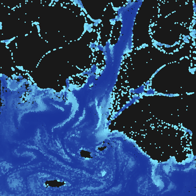

The code of several works on [oimo.io/works](https://oimo.io/works)
---

## When you try to compile
- Use the latest [Haxe](https://haxe.org/)
- Copy personal libs from [here](https://github.com/saharan/haxelibs/)
- **I often add breaking changes to the personal libs and projects, do not always expect successful compilations!**

## Bubbles
  
Code: [`/bubbles`](bubbles)

## Jelly
  
Code: [`/jelly`](jelly)

## Clock
  
Code: [`/clock`](clock)

## Water
  
Code: [`/water`](water)
